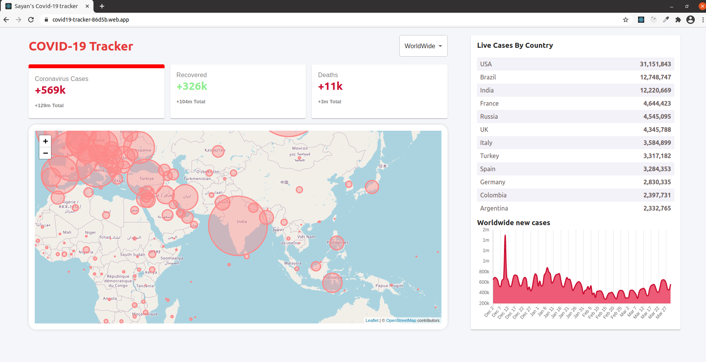
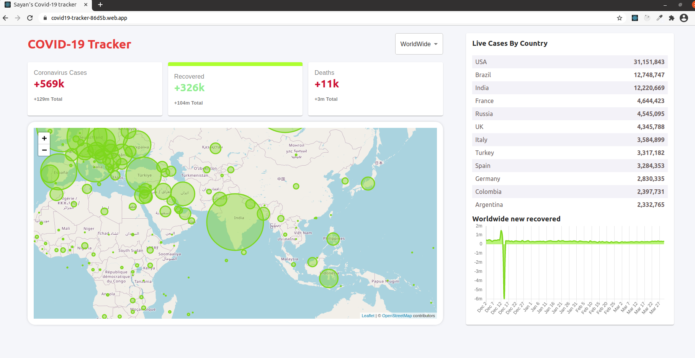
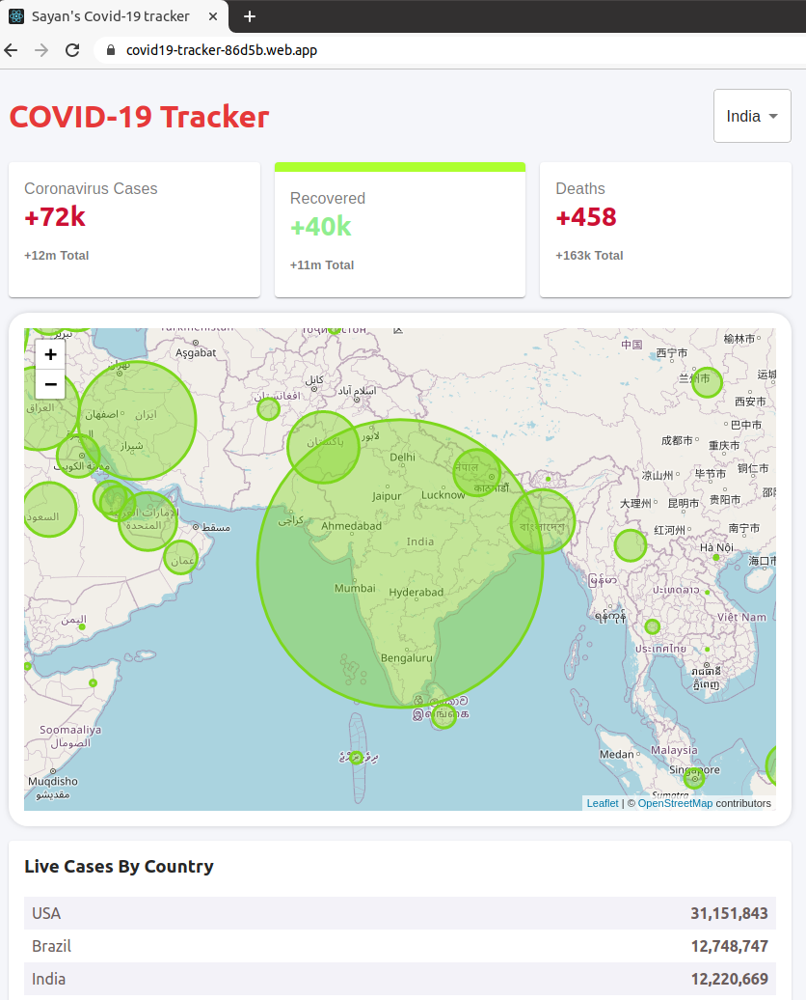

# Covid 19 tracker

A Covid 19 tracker created with [Create React App](https://github.com/facebook/create-react-app).

## API
All data has been pulled from [Disease.sh](https://disease.sh/docs/)

## Home Page with active cases

## Home Page with recovered cases

## Mobile responsive home page with Recovered cases from India

## Home Page with deceased cases

## Features
1. Dropdown to select which country details to view
2. 3 clickable information boxes containing details about **Active, Recovered and Deceased** cases
3. **Clicking** on each info box **changes the map** present below, in accordance to the details of the info box
4. A **table** providing **current active cases** of each country
5. A **graph** depicting **active,recovered and deceased** cases for the last **120 days**
6. Map is **zoomable** on scroll
7. Map has **circles** depiciting areas inflicted with covid. It also shows recovered and deceased case details.
8. Clicking on each circle displays a **popup with country flag, country name, active cases, recovered cases and deceased cases details**

## Deployment
The app is deplyed [here](https://covid19-tracker-86d5b.web.app/) with the help of [Firebase](https://console.firebase.google.com)